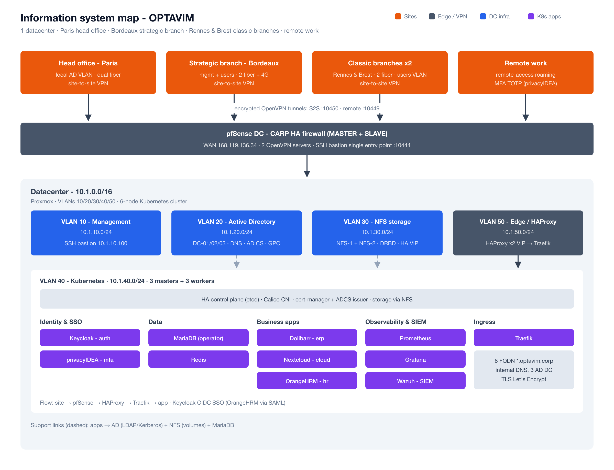

<p align="center"></p>

# OPTAVIM — Kubernetes Manifests

> Self-hosted multi-site enterprise IT system — hand-built Kubernetes, AD, SSO, MFA, SIEM, site-to-site VPN.




## At a glance

- **HA Kubernetes cluster** hand-built from scratch: 3 masters + 3 workers (kubeadm, Calico CNI).
- **Active Directory**: 3 domain controllers + AD CS (internal certificate authority).
- **SSO + MFA**: Keycloak as OIDC/SAML identity provider, second factor via privacyIDEA.
- **Storage & data**: HA NFS (DRBD), MariaDB Operator and Redis in-cluster.
- **Business apps**: Dolibarr, Nextcloud, OrangeHRM, all wired to SSO.
- **Observability & security**: Prometheus + Grafana, Wazuh as SIEM, pfSense HA + site-to-site VPN.

📖 **[Read the full project write-up →](https://knezan.fr/articles/optavim-si-entreprise-complet)**

## Table of contents

- [Cluster](#cluster)
- [Repository layout](#repository-layout)
- [Deploy](#deploy)
- [Roadmap — project status](#roadmap--project-status)
- [Known limits & technical debt](#known-limits--technical-debt-tracked-on-purpose)
- [Deep dives / Documentation](#deep-dives--documentation)

---

## About

A **showcase of a self-hosted, multi-site enterprise IT system**: a hand-built Kubernetes
cluster wired to Active Directory, SSO, MFA, monitoring, SIEM and a site-to-site VPN. The
manifests and docs here show **what was designed and built**, the architecture choices made,
and the trade-offs behind them. It is a portfolio of the system, not a step-by-step redeploy kit.

## Cluster

Network **segmented into 5 VLANs** (migration `/16 → /24 + Proxmox tags`):

| VLAN | Subnet | pfSense gateway | Contents |
|---:|---|---|---|
| 10 | `10.1.10.0/24` | `10.1.10.254` | pfSense (`.1`/`.2` + VIP `.3`), Bastion (`.100`) |
| 20 | `10.1.20.0/24` | `10.1.20.254` | AD DC-01 (FSMO) / DC-02 / DC-03 |
| 30 | `10.1.30.0/24` | `10.1.30.254` | NFS-01 / NFS-02 (DRBD + Pacemaker) + VIP `.100` |
| 40 | `10.1.40.0/24` | `10.1.40.254` | K8s masters `.1/.2/.3` + workers `.4/.5/.6` (Ubuntu 22.04, kubeadm v1.35.2) |
| 50 | `10.1.50.0/24` | `10.1.50.254` | HAProxy-01/02 (keepalived) + API VIP `.100` |

- **API VIP**: `10.1.50.100:6443` (HAProxy + keepalived → masters backend)
- **Ingress**: NodePort 30080/30443 on workers, exposed via HAProxy (port 443)
- **AD domain**: `optavim.corp` (legacy: `opvatim.local`, never used in prod)
- **Pod CIDR**: `10.200.0.0/16` (K8s internal, Calico VXLAN encapsulated)
- **Service CIDR**: `10.201.0.0/16` (K8s internal)
- **CNI**: Calico v3.27 (VXLAN, iptables-legacy)
- **Inter-VLAN routing**: via pfSense

## Repository layout

```
optavim-k8s-manifests/
├── 00-calico/                 # Calico CNI (via tigera-operator)
├── 01-namespaces/             # 7 namespaces
├── 02-storage/                # 3 RWX PVs + 7 RWO PVs (nfs-client)
│   ├── pv-rwx/
│   └── pv-rwo/
├── 03-resourcequotas/         # Per-namespace quotas
├── 04-nfs-provisioner/        # Helm nfs-subdir-external-provisioner
├── 05-databases/              # Database + cache
│   ├── mariadb-operator/      # MariaDB Operator (the database)
│   └── redis/                 # Redis cache
├── 06-ingress/                # Traefik + cert-manager + adcs-issuer
│   ├── cert-manager/          # Helm install + wildcard Certificate
│   ├── adcs-issuer/           # Helm install + ClusterAdcsIssuer (AD CS)
│   └── traefik/               # Deployment 2r + NodePort Service + TLSStore
├── 07-keycloak/               # StatefulSet 2r (probes /realms/master)
│   └── secrets-templates/     # keycloak-secret + truststore + ldap-ca-cert
├── 08-apps/                   # Business applications
│   ├── nextcloud/             # cloud.optavim.corp
│   ├── dolibarr/              # erp.optavim.corp
│   └── orangehrm/             # rh.optavim.corp
├── 08-privacyidea/            # MFA RADIUS (2FA for the remote-work VPN)
├── 09-monitoring/             # Monitoring: Prometheus + Grafana
│   ├── prometheus/            # scrape + TSDB (5Gi PV)
│   ├── node-exporter/         # DaemonSet host metrics
│   ├── kube-state-metrics/    # K8s object metrics
│   └── grafana/               # dashboards + Keycloak OIDC (grafana.optavim.corp)
├── 10-security/               # Wazuh SIEM
│   └── wazuh/                 # indexer + manager + dashboard (wazuh.optavim.corp)
├── docs/                      # Architecture, observability and security docs (+ diagrams)
├── apply.sh                   # Deploy the whole stack (kubectl apply -k, in order)
├── stop.sh                    # Stop the workloads (scale to 0, data kept)
├── LICENSE                    # MIT
├── SECURITY.md                # Security policy
└── README.md                  # README
```

## Deploy

The Helm operators are prerequisites (install them first): Calico (tigera-operator), nfs-subdir-external-provisioner, cert-manager, adcs-issuer, mariadb-operator. Fill in the secrets (replace the `CHANGE_ME_*` placeholders) before applying.

```bash
./apply.sh   # deploy the whole stack, in dependency order
./stop.sh    # stop the workloads (scale to 0; PVCs and data are kept)
```

## Roadmap — project status

Snapshot 2026-04-23:

| # | Phase | Status | Detail |
|---|---|---|---|
| 1 | Bastion + flat network | ✅ | 10.1.10.100, SSH hardening |
| 2 | AD × 3 | ✅ | 3 DCs answering LDAP/LDAPS/Kerberos |
| 3 | NFS HA DRBD+Pacemaker | ✅ | VIP 10.1.30.100, failover tested |
| 4 | K8s cluster | ✅ | Calico only (kube-router purged 04/23), BGP mesh restored |
| 5 | DB + Ingress | ✅ | MariaDB Operator, Redis, Traefik 2/2 |
| 6 | Keycloak + apps + MFA | ✅ | Keycloak 2/2 + OPTAVIM realm with LDAPS/TOTP + 5 clients; Nextcloud/Dolibarr/OrangeHRM 2/2 each; privacyIDEA (VPN 2FA) |
| 7 | Monitoring + SIEM | ✅ | Prometheus + Grafana (OIDC) + node-exporter DS + kube-state-metrics + Wazuh 3/3 (indexer + manager + dashboard) |
| 8 | VLAN segmentation | 🟡 | VLAN segmentation plan ready — migration pending |

## Known limits & technical debt (tracked on purpose)

- **Database = MariaDB Operator**: the database is the **MariaDB Operator** (`05-databases/mariadb-operator/`). The old self-managed Galera StatefulSet has been removed (migration complete). Volumes and the Service keep `galera-*` names for application compatibility, but the technology is the operator. The operator recovers Galera quorum on its own after an ungraceful shutdown (verified on the cluster), unlike a manual recovery script.
- **Kube-router + Calico (historical)**: two CNIs once coexisted on the cluster (historical residue, now purged). The migration to Calico only is complete.
- **Keycloak — probes**: the `/health/*` endpoints would require `--features=health`. We use `/realms/master` (200 OK) for probes, with a generous `startupProbe` (5 min) for the Quarkus boot.

## Security

Every credential in this repo is an intentional `CHANGE_ME` placeholder (real lab
secrets were scrubbed and rotated). Workloads follow a hardening baseline —
`allowPrivilegeEscalation: false`, drop `ALL` caps, `seccompProfile: RuntimeDefault`,
resource limits and per-namespace NetworkPolicies — and the handful of accepted
exceptions are documented and justified, not silently suppressed. A CI gate runs
gitleaks, trivy, kube-linter and kubeconform on every push and PR.

📖 Full posture, hardening details and accepted exceptions: [docs/SECURITY-posture.md](docs/SECURITY-posture.md).

## Deep dives / Documentation

A selection of the project's most telling technical pieces:

| Document | Description |
|---|---|
| [docs/CARTOGRAPHY_OPTAVIM.md](docs/CARTOGRAPHY_OPTAVIM.md) | Complete map of the IT system (sites, VLANs, datacenter, flows). |
| [docs/MONITORING_DASHBOARDS.md](docs/MONITORING_DASHBOARDS.md) | 10 Grafana dashboards as-code + exporters. |
| [docs/SECURITY-posture.md](docs/SECURITY-posture.md) | Hardening baseline, accepted exceptions, CI security gate. |
| [08-apps/README.md](08-apps/README.md) | SSO wiring of the 3 business apps + pitfalls encountered. |
| [08-apps/dolibarr/03-oidc-patch.md](08-apps/dolibarr/03-oidc-patch.md) | 3 Dolibarr 19 OIDC bugs dissected + fix. |
| [08-apps/nextcloud/03-ldap-failover.md](08-apps/nextcloud/03-ldap-failover.md) | Nextcloud LDAP HA failover (multi-URI ldaps:// config). |
| [08-privacyidea/README.md](08-privacyidea/README.md) | 2FA flow OpenVPN → RADIUS → privacyIDEA → LDAP. |

See also: [`docs/`](docs/) (full documentation index) · [SECURITY.md](SECURITY.md) (security policy).
