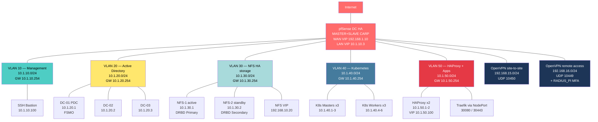
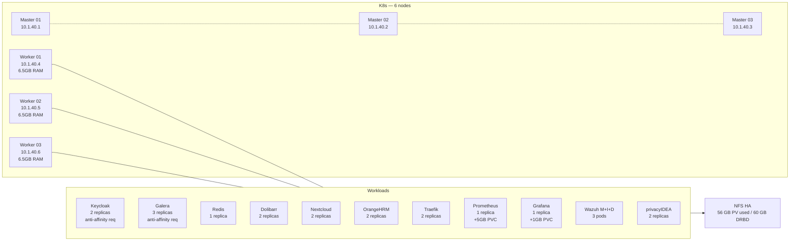
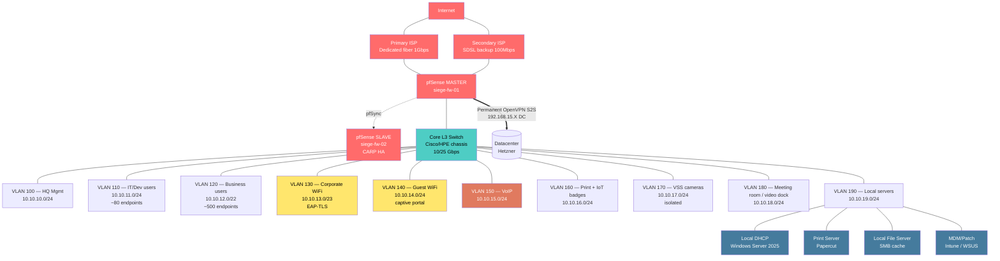
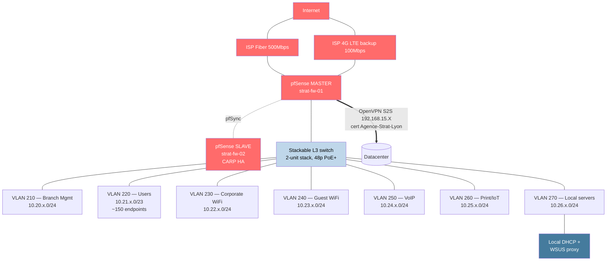
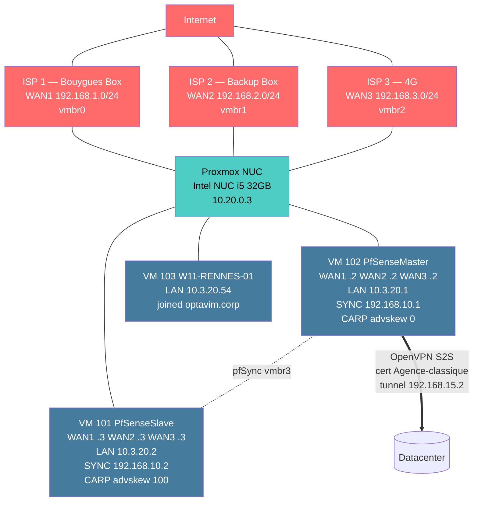

# OPTAVIM, infrastructure cartography

> Overview of the project's 4 site types: **1 real datacenter** (the cluster that is actually deployed) and **3 scenario site types** that extend the architecture into a multi-site enterprise IT system. Sections marked "**[scenario]**" are architecture assumptions (lab extensions, not deployed). Everything else describes the datacenter that was actually built (pfSense, K8s cluster, AD, NFS HA, Rennes branch office).

## Table of contents

1. [Overview, all sites](#1-overview-all-sites)
2. [Datacenter, Hetzner Falkenstein](#2-datacenter-hetzner-falkenstein-real)
3. [Headquarters, Paris 10 (scenario)](#3-headquarters-paris-10-scenario)
4. [Strategic branch office, Lyon/Bordeaux/Toulouse (scenario)](#4-strategic-branch-office-lyonbordeauxtoulouse-scenario)
5. [Standard branch office, Rennes (real) + others (scenario)](#5-standard-branch-office-rennes-real--others-scenario)
6. [Condensed global inventory](#6-condensed-global-inventory)
7. [Appendices, flows, DNS, certs](#7-appendices-flows-dns-certs)

---

## 1. Overview, all sites

```mermaid
flowchart LR
    classDef dc fill:#0b3954,color:#fff,stroke:#fff
    classDef siege fill:#087e8b,color:#fff,stroke:#fff
    classDef strat fill:#bfd7ea,color:#000,stroke:#000
    classDef classique fill:#ff5a5f,color:#fff,stroke:#000
    classDef tt fill:#c81d25,color:#fff,stroke:#000

    Internet((Internet))
    DC[Datacenter Hetzner<br/><BASTION_PUBLIC_IP><br/>VLANs 10/20/30/40/50<br/>K8s 6 nodes + AD 3 DCs + NFS HA]:::dc
    SIEGE[Headquarters Paris 10<br/>2500 staff<br/>local LAN infra + VPN S2S]:::siege
    STRAT1[Strategic branch Lyon<br/>150 staff]:::strat
    STRAT2[Strategic branch Bordeaux<br/>150 staff]:::strat
    STRAT3[Strategic branch Toulouse<br/>150 staff]:::strat
    AC1[Standard branch<br/>Rennes 20 staff]:::classique
    AC2[Brest / Lille / Strasbourg<br/>Paris 1/6/13<br/>15-30 staff each]:::classique
    TT[Remote work<br/>~700 roaming staff]:::tt

    Internet <--> DC
    Internet <-->|VPN S2S OpenVPN UDP 10450| SIEGE
    Internet <-->|VPN S2S OpenVPN UDP 10450| STRAT1
    Internet <-->|VPN S2S OpenVPN UDP 10450| STRAT2
    Internet <-->|VPN S2S OpenVPN UDP 10450| STRAT3
    Internet <-->|VPN S2S OpenVPN UDP 10450| AC1
    Internet <-->|VPN S2S OpenVPN UDP 10450| AC2
    Internet <-->|VPN remote access OpenVPN UDP 10449<br/>+ RADIUS_PI MFA TOTP| TT

    SIEGE -.->|tunnel 192.168.15.0/24| DC
    STRAT1 -.->|tunnel 192.168.15.0/24| DC
    STRAT2 -.->|tunnel 192.168.15.0/24| DC
    STRAT3 -.->|tunnel 192.168.15.0/24| DC
    AC1 -.->|tunnel 192.168.15.0/24| DC
    AC2 -.->|tunnel 192.168.15.0/24| DC
    TT -.->|tunnel 192.168.16.0/24| DC
```



| Site | Count | Staff (estimated) | Role | Links to DC |
|---|---|---|---|---|
| Datacenter Hetzner | 1 | — | Hosting of OPTAVIM apps (K8s + AD + NFS + Wazuh + monitoring + IDM) | — |
| Headquarters Paris 10 | 1 | ~700 | Management, IT, HR, Accounting, Marketing, Dev | Permanent OpenVPN S2S; dual-ISP WAN HA |
| Strategic branch office | 3 (Lyon, Bordeaux, Toulouse) | ~150/site = 450 | Regional delegations + critical ops | Permanent OpenVPN S2S; WAN HA |
| Standard branch office | 7 (Brest, Rennes, Lille, Strasbourg, Paris 1, Paris 6, Paris 13) | ~20-30/site ≈ 175 | Local service offices | OpenVPN S2S; triple-WAN load balance (Rennes: 3 fibers) |
| Remote work | ~700 | 700 | Roaming (personal or company laptop) | OpenVPN remote-access + privacyIDEA MFA |
| **TOTAL** | **12 sites + RA** | **~2025** | | |

> Note: the business target is ~2500 staff. The gap with the total above can be interns/temps/inactive accounts.

---

## 2. Datacenter, Hetzner Falkenstein (real)

> **Source**: direct observations via the bastion (`<BASTION_PUBLIC_IP>:10444`). This is the only site whose inventory is 100% verified (actually deployed).

### 2.1. Logical VLAN view



### 2.2. Physical/VM inventory (verified)

| VM | Replicas | IP | OS | Role | Status |
|---|---|---|---|---|---|
| **pfSense DC** | 2 (CARP HA) | WAN VIP 192.168.1.10 ; LAN VIP 10.1.10.3 ; MASTER `.1` SLAVE `.2` | FreeBSD 15 / pfSense 2.8.1 | Firewall + OpenVPN server (2 instances) + RADIUS pass-thru | ✅ MASTER active, SLAVE unknown |
| **Bastion** | 1 | 10.1.10.100 + WAN <BASTION_PUBLIC_IP>:10444 | Ubuntu 22.04 | SSH jump host + sshpass + kubectl + curl | ✅ |
| **AD DC-01** | 1 | 10.1.20.1 | Windows Server 2025 | FSMO PDC, DNS, NETLOGON | ✅ |
| **AD DC-02** | 1 | 10.1.20.2 | Windows Server 2025 | AD replication | ✅ |
| **AD DC-03** | 1 | 10.1.20.3 | Windows Server 2025 | AD replication | ✅ |
| **NFS-1** | 1 | 10.1.30.1 | Ubuntu 22.04 | DRBD primary, exports `/exports/{nextcloud,dolibarr,orangehrm,galera-0..2,prometheus,grafana,wazuh-mgr,wazuh-idx}` | ✅ |
| **NFS-2** | 1 | 10.1.30.2 | Ubuntu 22.04 | DRBD secondary, Pacemaker standby | ✅ |
| **K8s Master 1-3** | 3 | 10.1.40.1-3 | Ubuntu 22.04, k8s 1.35.2 | HA control plane, etcd | ✅ Ready |
| **K8s Worker 1-3** | 3 | 10.1.40.4-6 | Ubuntu 22.04, k8s 1.35.2, +1GB RAM | Workload pods | ✅ Ready |
| **HAProxy** | 2 | 10.1.50.1-2, VIP 10.1.50.100 (keepalived VRRP) | Ubuntu 22.04 | LB in front of K8s NodePort 30080/30443 | ✅ |

**Total DC resources**: 38 GB RAM ; 385 GB disk ; ~17 VMs excluding pfSense.

### 2.3. K8s workloads (namespaces + pods)

| Namespace | Pods | Apps |
|---|---|---|
| `kube-system` | 21 | CoreDNS, kube-proxy, control-plane |
| `calico-system` | 16 | CNI (Calico Operator v3.x) |
| `calico-apiserver` | 2 | Calico API |
| `tigera-operator` | 1 | Calico mgmt |
| `cert-manager` | 3 | Cert issuance Let's Encrypt + ADCS |
| `adcs-issuer` | 1 | Bridge to AD Certificate Services (internal PKI) |
| `auth` | 1 | Keycloak (OIDC/SAML SSO for the apps) |
| `identity` | 2 | privacyIDEA (TOTP MFA for the remote-work VPN) |
| `databases` | 4 | Galera 3 nodes + standalone Redis |
| `apps` | 3 | Dolibarr, Nextcloud, OrangeHRM |
| `monitoring` | 9 | Prometheus, Grafana, Grafana Alloy (DaemonSet) |
| `security` | 3 | Wazuh Manager + Indexer + Dashboard |
| `ingress` | 1 | Traefik (NodePort 80/443 -> 30080/30443) |
| `default` | 1 | misc |

**FQDNs exposed via Traefik (internal DNS on DC-01/02/03)**:

| FQDN | K8s app | Auth |
|---|---|---|
| `auth.optavim.corp` | Keycloak | local (admin) |
| `mfa.optavim.corp` | privacyIDEA | local + AD LDAP |
| `cloud.optavim.corp` | Nextcloud | OIDC via Keycloak |
| `erp.optavim.corp` | Dolibarr | OAuth/OIDC via Keycloak |
| `rh.optavim.corp` | OrangeHRM | SAML (non-OSS, manual) |
| `grafana.optavim.corp` | Grafana | OIDC via Keycloak |
| `wazuh.optavim.corp` | Wazuh Dashboard | SAML/OIDC OpenSearch Security |
| `dashboard.optavim.corp` | Traefik dashboard | basic auth |

### 2.4. OpenVPN, 2 servers

| ID | Port | Tunnel net | Mode | Auth | Use |
|---|---|---|---|---|---|
| `OPENVPN_client_to_site` | UDP 10449 | 192.168.16.0/24 | Remote Access SSL/TLS + User Auth | Cert + RADIUS (privacyIDEA TOTP) | Remote work (700 staff) |
| `VPN site to site` | UDP 10450 | 192.168.15.0/24 | Peer-to-Peer SSL/TLS | Cert only (per-site CSO) | Permanent sites (HQ + 10 branches) |

**CSO (Client-Specific Overrides) known on the DC side**:
- `Siege_overrides` (cert "vpn site to site user siege"), pushes route 10.0.0.0/16 <- obsolete, should be the 10.0.x.x target
- `Agence-classique` (cert "Agence-classique"), pushes route 10.3.20.0/24 (= Rennes LAN)
- **To do**: create one CSO per site (`Agence-Strat-Lyon`, etc.) with its own LAN

### 2.5. K8s cluster, detailed workload (Excel extract + runtime validation)



**NFS storage** (DRBD replicated sync between NFS-1/NFS-2, Pacemaker fails over VIP 192.168.10.20):

| PV | Mode | Size | Consumers |
|---|---|---|---|
| nextcloud-data | RWX | 10 GB | Nextcloud x2 |
| dolibarr-data | RWX | 5 GB | Dolibarr x2 |
| orangehrm-data | RWX | 5 GB | OrangeHRM x2 |
| galera-{0,1,2} | RWO | 3×5 GB | Galera x3 |
| prometheus | RWO | 5 GB | Prometheus |
| grafana | RWO | 1 GB | Grafana |
| wazuh-mgr | RWO | 5 GB | Wazuh Manager |
| wazuh-idx | RWO | 10 GB | Wazuh Indexer |
| **TOTAL** | | **56 GB** | |

---

## 3. Headquarters, Paris 10 (scenario)

> **[scenario]** The OpenVPN log shows `cert vpn site to site user siege` connected from IP `<SIEGE_PUBLIC_IP>` (= simulated public IP of the HQ). The HQ is the central office with management + IT + dev. ~700 staff on site.

### 3.1. Target architecture



### 3.2. HQ hardware inventory (**[scenario]**)

| Equipment | Estimated model | Qty | Role |
|---|---|---|---|
| pfSense (HW) | Netgate 6100/8200 or XL | 2 | Firewall HA CARP |
| Core L3 switch | Cisco Catalyst 9300 2-unit stack / HPE FlexFabric | 1 stack | Inter-VLAN routing + uplink |
| Access switch | Cisco Cat 2960X PoE / HPE 1950 PoE | ~15 | 48 PoE ports per floor |
| WiFi controller + AP | Aruba / Cisco Meraki | 1 ctrl + ~40 AP | Coverage of 2 offices |
| Telephony | Cloud IPBX (Aircall/Ringover) or 3CX | 1 | VoIP via VLAN 150 |
| Print | Xerox MFP × 8 + Papercut server | 8 + 1 | Secure pull-printing |
| VSS cameras | Hikvision / Axis | ~30 | Isolated VLAN 170 |
| Local server | 1 Proxmox/ESXi host, 64GB RAM | 1 | Local DHCP + WSUS + SMB cache |
| UPS | APC SmartUPS 5kVA | 2 | Network rack backup |

### 3.3. Main HQ flows

| Source | Dest | Port | Note |
|---|---|---|---|
| V120 (business users) | DC `cloud.optavim.corp` (10.1.50.100) | TCP 443 | Via OpenVPN S2S (route table) |
| V110 (IT/Dev) | DC `grafana.optavim.corp` + Wazuh + Traefik dashboard | TCP 443 | IT bookmarks via GPO |
| V130 (corp WiFi) | Same as V120 but after EAP-TLS auth | TCP 443 | AD CS cert auth |
| V140 (Guest WiFi) | Internet only (WAN NAT, **no VPN**) | TCP/UDP 80, 443 | Bandwidth limited |
| V100 (Mgmt) | pfSense WebUI + AP controller + UPS | TCP 443 | Local IT admin |
| V160 (Print) | V120 + V110 (printing) | TCP 9100, 631 | One direction only |
| V170 (Cameras) | Local NVR + cloud (Hikvision) | TCP/RTSP | Isolated from the rest |
| V150 (VoIP) | Internet or SaaS IPBX | UDP 10000-20000 RTP, TCP 5060 SIP | Priority QoS |

### 3.4. GPOs applied at the HQ (GPO deck in place)

All 14 `OPTAVIM-*` GPOs from the deck apply. HQ-specific:
- `OPTAVIM-C-06-USB-Storage-Block`: block USB mass storage (except exceptions)
- Computer GPO `OPTAVIM-C-01-SecurityBaseline`: Defender ON, LLMNR off, SMBv1 off, audit policy, **loopback merge**
- User GPO `OPTAVIM-U-07-Bookmarks-IT-Admins`: for the HQ IT sysadmins

---

## 4. Strategic branch office, Lyon/Bordeaux/Toulouse (scenario)

> **[scenario]** 3 regional branches with ~150 staff each. More structured than a standard branch but less than the HQ. Likely a mix of ops + sales + middle management.

### 4.1. Target architecture



**Differences vs HQ**:
- WAN: 1 fiber + 1 4G backup (vs 2 fibers at the HQ)
- Switch: 2-unit stack (vs 3-4 unit stack + chassis at the HQ)
- No dedicated meeting-room VLAN
- No separate camera VLAN (tolerated on the print/IoT VLAN)
- No local file server (SMB cache via Nextcloud is fine)
- Local DHCP optional (can be centralized via pfSense)

### 4.2. Site-specific notes

| Item | Lyon | Bordeaux | Toulouse |
|---|---|---|---|
| **VLAN range** | 10.20.0.0/16 | 10.21.0.0/16 | 10.22.0.0/16 |
| **AD OU** | `OU=Lyon,OU=Agences_Strategiques,OU=OPTAVIM` | same as `Bordeaux` | same as `Toulouse` |
| **OpenVPN CSO** | `Agence-Strat-Lyon` | `Agence-Strat-Bordeaux` | `Agence-Strat-Toulouse` |
| **Pushed routes** | `10.20.0.0/16` | `10.21.0.0/16` | `10.22.0.0/16` |
| **GPO** | All `OPTAVIM-*` + `OPTAVIM-C-06-USB-Storage-Block` linked to the OU |

---

## 5. Standard branch office, Rennes (real) + others (scenario)

> **Rennes source**: observed live on the lab (the Excel inventory only covers the datacenter).

### 5.1. Rennes architecture (real)



### 5.2. Rennes inventory (real)

| Item | Spec | IP | Status |
|---|---|---|---|
| Proxmox host | Intel NUC i5, 32GB RAM, 500GB NVMe | wlp58s0 DHCP wifi + nic0 / vmbr0-5 | ✅ |
| Proxmox bridges | vmbr0 (WAN1 sim), vmbr1 (WAN2), vmbr2 (WAN3), vmbr3 (pfSync), vmbr4 (LAN), vmbr5 (extra) | — | ✅ |
| pfSense MASTER (VM 102) | 512 MB / 1 vCPU / 10GB | LAN 10.3.20.1, WAN1 192.168.1.2 | ✅ |
| pfSense SLAVE (VM 101) | 512 MB / 1 vCPU / 10GB | LAN 10.3.20.2, WAN1 192.168.1.3 | ✅ CARP BACKUP, openvpn-client disabled |
| W11-RENNES-01 (VM 103) | 6 GB / 2 vCPU / 50GB | 10.3.20.54 DHCP | ✅ joined optavim.corp, GPOs applied |
| LAN CARP VIP | 10.3.20.99 (observed on the W11 endpoint) or 10.30.0.1 (Excel inventory), to confirm | — | ✅ |

### 5.3. Reusable pattern for other standard branches

| Branch | LAN subnet | NUC host IP (mgmt VPN) | AD OU | OpenVPN CSO |
|---|---|---|---|---|
| Brest | 10.3.10.0/24 | 10.20.0.10 | `OU=Brest,...` | `Agence-Classique-Brest` |
| Rennes | 10.3.20.0/24 | 10.20.0.3 (existing) | `OU=Rennes,OU=Agences_Classiques,OU=OPTAVIM` | `Agence-classique` (= Rennes) ⚠️ to rename |
| Lille | 10.3.30.0/24 | 10.20.0.30 | `OU=Lille,...` | `Agence-Classique-Lille` |
| Strasbourg | 10.3.40.0/24 | 10.20.0.40 | `OU=Strasbourg,...` | `Agence-Classique-Strasbourg` |
| Paris 1 | 10.3.50.0/24 | 10.20.0.50 | `OU=Paris_1,...` | `Agence-Classique-Paris1` |
| Paris 6 | 10.3.60.0/24 | 10.20.0.60 | `OU=Paris_6,...` | `Agence-Classique-Paris6` |
| Paris 13 | 10.3.70.0/24 | 10.20.0.70 | `OU=Paris_13,...` | `Agence-Classique-Paris13` |

> Convention `10.3.<10×N>.0/24`, handy for generic firewall rules on the DC (group `Agences_classiques_LAN = 10.3.0.0/16`).

### 5.4. Standard branch design on one page

The standard-branch pattern is built from a pfSense pair restored on a small Proxmox host, joined to the datacenter over a per-site OpenVPN tunnel:

1. Restore the VMA images from the `master.vma` + `slave.vma` snapshots
2. Reconfigure the slave (IPs `.3`, advskew 100) via PHP script
3. CARP HA sync: LAN VIP, xmlrpc sync MASTER->SLAVE
4. pfSense-managed OpenVPN client, per-site cert
5. Outbound NAT on ovpnc1: `LAN/24 -> 192.168.15.X port 1024:65535`
6. **Critical fix**: bypass policy-routing rule for `dest = 10.1.0.0/16` BEFORE the "Web rules" load-balance gateway-group rule
7. W11 VM -> join `optavim.corp` over the VPN -> GPOs applied on next reboot

---

## 6. Condensed global inventory

### 6.1. Infrastructure totals

| Category | Quantity | Notes |
|---|---|---|
| Physical sites | 12 (1 DC + 1 HQ + 3 strategic + 7 standard) | + 700 remote workers |
| pfSense in prod | 24 (12 sites × HA) | DC = 2 verified, others = scenario |
| Permanent OpenVPN tunnels | 11 (1 HQ + 3 strategic + 7 standard) | + 1 remote-access instance for remote work |
| AD DCs | 3 (at the DC) | + 0 RODC on sites (to consider) |
| K8s nodes | 6 (3+3) | at the DC only |
| Business apps | 6 + 2 cross-cutting | Nextcloud, Dolibarr, OrangeHRM + Keycloak, privacyIDEA |
| Target total staff | 2500 | including ~700 remote workers |

### 6.2. Global addressing plan

| Network | Use |
|---|---|
| `10.1.0.0/16` | Datacenter (10.1.10/20/30/40/50.x) |
| `10.2.0.0/16` | Headquarters Paris 10 (VLAN 100-190 under 10.10.x.y/22), **[scenario]** or recommended |
| `10.10.0.0/16` | Headquarters, mapping to confirm |
| `10.20.0.0/16` | Lyon branch, **[scenario]** |
| `10.21.0.0/16` | Bordeaux branch, **[scenario]** |
| `10.22.0.0/16` | Toulouse branch, **[scenario]** |
| `10.3.0.0/16` | All standard branches (`/24` subnet per branch) |
| `10.3.20.0/24` | Rennes (real) |
| `192.168.15.0/24` | OpenVPN site-to-site (internal tunnel) |
| `192.168.16.0/24` | OpenVPN remote access (internal tunnel) |
| `192.168.10.0/24` | DC pfSync + NFS VIP |
| `192.168.1-3.0/24` | Branch WAN simulations (Bouygues / backup / 4G) |

---

## 7. Appendices, flows, DNS, certs

### 7.1. Datacenter flow matrix (from Excel + observations)

| Source ↓ / Dest → | VLAN 10 Mgmt | VLAN 20 AD | VLAN 30 NFS | VLAN 40 K8s | VLAN 50 Apps |
|---|---|---|---|---|---|
| **VLAN 10 Mgmt** | — | SSH 22 + RDP 3389 + DNS 53 | SSH 22 | SSH 22 + API 6443 | SSH 22 |
| **VLAN 20 AD** | ✗ | AD replication + LDAP 389/636 + Kerberos 88 + SMB 445 + DNS 53 | ✗ | ✗ | ✗ |
| **VLAN 30 NFS** | ✗ | ✗ | DRBD 7788 + NFS sync | NFS 2049 + RPCbind 111 | ✗ |
| **VLAN 40 K8s** | ✗ | DNS 53 + LDAP 389/636 + Kerberos 88 | NFS 2049 + RPCbind 111 | etcd 2379-2380 + API 6443 + Kubelet 10250 + CNI overlay + CoreDNS | ✗ |
| **VLAN 50 Apps** | ✗ | ✗ | ✗ | API 6443 + NodePort 30000-32767 + Ingress 80/443 | VRRP (keepalived), Protocol 112 |

### 7.2. Internal DNS `optavim.corp`

All app FQDNs resolve on the 3 AD DCs (round-robin). Key FQDNs:

```
auth.optavim.corp     → 10.1.50.100  (Keycloak via Traefik)
mfa.optavim.corp      → 10.1.50.100  (privacyIDEA via Traefik)
cloud.optavim.corp    → 10.1.50.100  (Nextcloud via Traefik)
erp.optavim.corp      → 10.1.50.100  (Dolibarr via Traefik)
rh.optavim.corp       → 10.1.50.100  (OrangeHRM via Traefik)
grafana.optavim.corp  → 10.1.50.100  (Grafana via Traefik)
wazuh.optavim.corp    → 10.1.50.100  (Wazuh via Traefik)
dashboard.optavim.corp → 10.1.50.100 (Traefik dashboard)

dc-ad-dc-01.optavim.corp → 10.1.20.1
dc-ad-dc-02.optavim.corp → 10.1.20.2
dc-ad-dc-03.optavim.corp → 10.1.20.3

dc-01.optavim.corp    → 10.1.20.1  (existing CNAME)
```

### 7.3. PKI

| CA | Use | Storage |
|---|---|---|
| **AD CS** (on DC-01) | Internal Windows certs (endpoint, EAP-TLS, RDP) | AD |
| **internal-ca vpn site to site** | OpenVPN site-to-site (HQ + branches) | pfSense DC Cert Manager |
| **internal-ca vpn remote access** | OpenVPN remote work | pfSense DC Cert Manager |
| **Let's Encrypt** (cert-manager K8s) | Public-facing TLS for `*.optavim.corp` | K8s Secret |
| **Wazuh root CA** | Wazuh agent auth | K8s Secret + agents |

### 7.4. Active management tools

| Tool | Where | Use |
|---|---|---|
| Prometheus + Grafana | K8s `monitoring` ns | Cluster + app metrics |
| Grafana Alloy (DaemonSet) | K8s | Log + metric collection on all nodes |
| Wazuh Manager + Indexer + Dashboard | K8s `security` ns | SIEM, EDR agents |
| privacyIDEA | K8s `identity` ns | TOTP MFA |
| Keycloak | K8s `auth` ns | OIDC/SAML SSO |
| RADIUS (pass-thru via Keycloak/privacyIDEA) | pfSense DC | Remote-work VPN auth |
| SSH Bastion | DC 10.1.10.100 | Jump host for admin of all sites |
| pfSense WebUI | Each site | Firewall admin |
| AD CS | DC-01 | Windows PKI |

---

> End of document.
